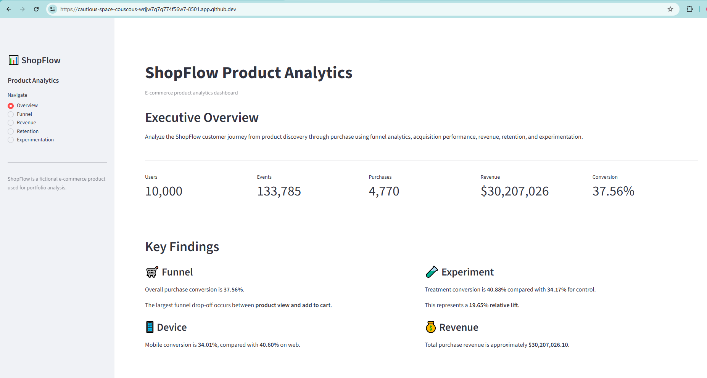

# ShopFlow E-commerce Product Analytics

A portfolio-ready Product Analytics project analyzing the customer journey of a fictional e-commerce product, **ShopFlow**.

The project combines data generation, ETL, SQL analytics, funnel analysis, revenue analysis, retention, A/B testing, and an interactive Streamlit dashboard to identify product growth opportunities.


---

## 📊 Dashboard

The Streamlit dashboard provides interactive views of the ShopFlow product analytics results, including funnel performance, revenue, retention, and experimentation.



---

## 📌 Project Overview

ShopFlow is a fictional e-commerce product with a customer journey that can be summarized as:

**App Open → Product View → Add to Cart → Checkout → Purchase**

The goal of this project is to answer practical product analytics questions:

- Where do users drop out of the purchase funnel?
- Which devices and acquisition channels perform best?
- Which channels and product categories generate the most revenue?
- How well do users return after their first activity?
- Does an A/B test meaningfully improve conversion?
- What product opportunities should the team prioritize?

---

## 🎯 Business Objective

The analysis is designed to help a product team improve:

1. **Conversion**
2. **Revenue**
3. **User retention**
4. **Acquisition efficiency**
5. **Experiment-driven product decisions**

---

## 💡 Executive Takeaways

The analysis identified several opportunities for improving ShopFlow's product performance:

- **Overall funnel conversion is 37.56%**, with the largest drop occurring between **Product View → Add to Cart**, where 31.28% of users are lost.
- **Mobile conversion is 34.01%**, compared with **40.60% on web**, suggesting an opportunity to investigate mobile product-page and shopping-flow friction.
- **Email has the highest overall conversion at 39.29%**, while **organic** generates the highest total revenue at approximately **$10.76M**.
- **Sports** generates the highest category revenue at approximately **$5.62M**, while **Furniture** has the highest average order value at approximately **$7,492**.
- **D1 retention is 9.49%, D7 retention is 6.67%, and D30 retention is 4.90%**, highlighting the importance of improving repeat engagement.
- The **A/B test treatment group increased conversion from 34.17% to 40.88%**, representing a **6.71 percentage-point lift** and **19.65% relative improvement**.
- The A/B test result is **statistically significant (p < 0.001)** based on a two-proportion z-test.

---


## 📊 Dataset

The project uses a synthetic e-commerce event dataset generated specifically for this analysis.

| Metric | Value |
|---|---:|
| Users | 10,000 |
| Events | 133,785 |
| Sessions | 45,147 |
| Purchase events | 4,770 |
| Unique purchasers | 3,756 |
| Analysis period | Jan–Jun 2026 |
| Products | 100 |
| Countries | 6 |
| Devices | Web, Mobile, Tablet |
| Traffic sources | Organic, Paid Search, Social, Email, Referral |

### Event Types

- `app_open`
- `search`
- `view_product`
- `add_to_cart`
- `checkout_start`
- `purchase`

---

## 🏗️ Project Architecture

```text
Raw Event Data
      │
      ▼
Data Generation
src/generate_data.py
      │
      ▼
Raw CSV
data/raw/raw_events.csv
      │
      ▼
ETL Pipeline
etl/etl_pipeline.py
      │
      ▼
Clean CSV
data/processed/clean_events.csv
      │
      ▼
SQLite Database
data/product_analytics.db
      │
      ├───────────────┐
      ▼               ▼
   SQL Analysis   Streamlit
      │            Dashboard
      ▼               │
 Business Insights ◄──┘
